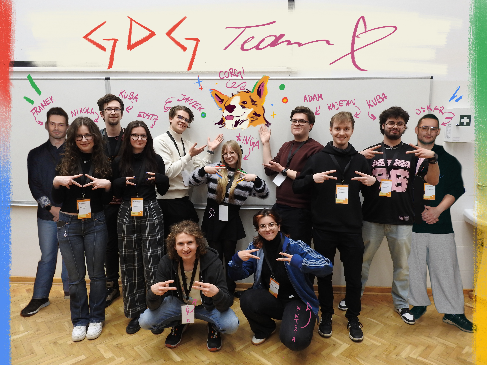

<h1 align="center">Hi, I'm Kinga! </h1>

  CS Student, Developer & Digital Artist  
  I love building things that are both functional and beautiful. 

### A Little About Me 

- 2nd year Applied Computer Science @ Warsaw University of Technology
- Marketing Lead @ Google Developer Group on Campus PW
- Passionate about digital art, illustration & 2D design
- Currently working on **TomoDochi** - a gamified task manager with a virtual pet
- Building my artistic portfolio alongside my coding projects

  

### Things I Work With 

  

  
  <a href="https://kingakirsz.com">My Website</a> &nbsp;|&nbsp;
  <a href="https://linkedin.com/in/kinga-kirsz">LinkedIn</a>
  

